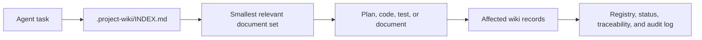

<h1 align="center">Project Wiki</h1>

<p align="center"><strong>Durable, traceable project memory for AI coding agents.</strong></p>

<p align="center">
Turn requirements, decisions, code knowledge, and project history into an indexed wiki that lives beside the source code and stays useful across agent sessions.
</p>

<p align="center">
  <a href="#quick-start">Quick start</a> &middot;
  <a href="#see-it-in-action">Examples</a> &middot;
  <a href="#command-modes">Commands</a> &middot;
  <a href="#documentation">Documentation</a> &middot;
  <a href="#contributing">Contributing</a>
</p>

<p align="center">
  <a href="LICENSE"></a>
  
  
  
  
</p>

Project Wiki is an IDE-neutral agent skill for creating and maintaining an agent-readable knowledge base in `.project-wiki/`. It works with chat-based coding agents such as GitHub Copilot in VS Code, Claude Code, Codex, and other compatible tools that can read and write repository files.

The wiki is designed for progressive disclosure: agents start at one short index, follow the smallest relevant set of links, and avoid flooding the context window with the entire project history.

## Why Project Wiki?

AI coding sessions are temporary. Requirements, architectural decisions, implementation details, and the reasons behind a change are not.

When that knowledge is scattered across chats, meeting notes, source documents, and source code, every new session starts with reconstruction. Project Wiki keeps the durable parts inside the repository and gives agents a repeatable way to retrieve and maintain them.

| Without Project Wiki | With Project Wiki |
| --- | --- |
| Re-explain the project in each session | Start from an indexed project overview |
| Requirements and code drift independently | Trace requirements, decisions, docs, and source paths |
| Meeting notes disappear into chat history | Classify them into requirements, CRs, ADRs, and open questions |
| Agents load too much context or guess | Route from `INDEX.md` to only the relevant documents |
| Manual code changes leave documentation stale | Reconcile implementation reality with `sync` |
| Contradictions and gaps remain implicit | Track semantic lint findings and durable alerts |

Project Wiki can track:

- Project goals, constraints, and explicit product intent.
- Functional and non-functional requirements.
- Lightweight change requests and scope history.
- Architectural decisions and their consequences.
- Technical documentation for implemented code.
- Work items, scans, sync reports, and implementation state.
- Open questions, significant risks, conflicts, and assumptions.
- Durable analyses that connect existing project records.
- Traceability between requirements, changes, decisions, docs, and source paths.
- An audit log of meaningful knowledge base edits.

## Quick Start

### 1. Install the skill

Place this directory in a skill location supported by your agent. A personal installation is available across projects; a repository installation can be shared with the team.

| Scope | Example path |
| --- | --- |
| Personal Agent Skills installation | `~/.agents/skills/project-wiki/` |
| Repository Agent Skills installation | `.agents/skills/project-wiki/` |
| GitHub Copilot repository skill | `.github/skills/project-wiki/` |
| Claude Code personal skill | `~/.claude/skills/project-wiki/` |

For example, after downloading or cloning this project:

```bash
mkdir -p ~/.agents/skills
cp -R /path/to/project-wiki ~/.agents/skills/project-wiki
```

### 2. Create the first wiki

From the target repository, initialize a new project:

```text
/project-wiki init
```

Or scan a repository that already contains meaningful source code:

```text
/project-wiki scan
```

The slash-style form is an invocation hint, not a strict CLI. Natural language works too:

```text
Use the project-wiki skill in scan mode. Analyze this repository and create the initial project wiki.
```

### 3. Work normally

Once `.project-wiki/INDEX.md` exists, ask the agent for ordinary implementation, debugging, refactoring, testing, documentation, or planning work. The skill should consult the relevant wiki context before acting and update affected wiki records after agent-made source changes.

## See It In Action

### Turn meeting notes into project history

```text
/project-wiki update

- Release one includes email notifications, not SMS.
- Tickets need low, medium, high, and urgent priorities.
- Administrators need CSV export.
- PostgreSQL is preferred over SQLite.
- It is unclear who can delete a closed ticket.
```

The update classifies explicit intent, creates lightweight change or decision records where appropriate, reconciles existing open questions, and refreshes status, registry, traceability, and the wiki audit log.

### Implement with automatic context

```text
Implement CSV export for ticket lists.
```

When the wiki exists, the agent should read the relevant requirement and technical records, implement and validate the change, then update affected docs and traceability before finishing. No separate `consult` command is required, and `sync` is not needed for source changes made by the agent in the same workflow.

### Reconcile manual changes

```text
/project-wiki sync

I manually changed the billing module and its tests outside this chat.
Reconcile the wiki with the current repository state.
```

The agent inspects changed source paths, updates observed technical behavior, and records an open question instead of inventing product intent when the intended scope is unclear.

### Repair wiki health

```text
/project-wiki maintain

Audit the wiki for broken links, missing registry entries, duplicate IDs,
stale indexes, unlinked records, and outdated status notes.
```

Maintenance checks the schema version, repairs safe structural inconsistencies, writes semantic lint results, updates significant alerts, and preserves history.

## How It Works



Indexes route, records explain, and traceability connects. Agents start at `.project-wiki/INDEX.md`, open only the records needed for the current task, and update the affected knowledge after the work is complete.

### Repository Layout

```text
project-wiki/
  SKILL.md
  README.md
  scripts/
    ingest_document.py
    requirements.txt
  references/
    document-ingestion.md
    wiki-structure.md
    workflows.md
  assets/
    document-templates.md
```

`SKILL.md` is the runtime entrypoint loaded by compatible agents.

`README.md` explains the skill for humans.

`scripts/ingest_document.py` extracts PDF, DOCX, text, or Markdown source documents into structured `.project-wiki/intake/` artifacts.

`scripts/requirements.txt` lists optional PDF/DOCX extraction dependencies.

`references/document-ingestion.md` defines document intake, chunking, generated artifacts, review gating, and KB integration rules.

`references/wiki-structure.md` defines the canonical `.project-wiki/` structure, document IDs, linking rules, registry format, and placeholder policy.

`references/workflows.md` defines the operational workflows for `init`, `scan`, `update`, `sync`, `maintain`, automatic context preflight, and automatic post-implementation wiki updates.

`assets/document-templates.md` provides reusable Markdown and YAML templates for generated wiki files and always-on project instruction blocks.

## Command Modes

The skill exposes these user-facing modes:

```text
init | scan | update | sync | maintain
```

These are hints, not a strict CLI parser. In Copilot, you can invoke the skill with prompts such as `/project-wiki init`. In other agents, use natural language such as "Use the project-wiki skill in scan mode".

| Mode | Purpose |
| --- | --- |
| `init` | Create a complete `.project-wiki/` scaffold for a new project. |
| `scan` | Analyze an existing codebase and generate the initial wiki. |
| `update` | Convert meeting minutes, documents, chat notes, planning notes, or new requirements into wiki updates. |
| `sync` | Reconcile the wiki with source code changes made manually or outside the current agent chat flow. |
| `maintain` | Audit and repair the wiki itself: links, indexes, registry entries, semantic lint, alerts, stale docs, and traceability consistency. |

You do not have to use these exact argument hints for the skill to be useful. They are invocation hints for explicit wiki-management tasks. The skill can still be selected by an agent when your request matches its description, such as asking to document requirements, update the project knowledge base, sync manual code changes, or implement code in a repository that already has `.project-wiki/`.

During `init` and `scan`, the skill also installs repository-level always-on instructions so future coding tasks keep using the wiki even when the user does not explicitly invoke the skill.

## Automatic Behavior

Two important behaviors are automatic and should not require explicit commands.

### Automatic Context Preflight

When `.project-wiki/INDEX.md` exists and the user asks the agent to implement, modify, debug, refactor, test, document, or plan code, the agent should first consult the wiki.

Expected behavior:

1. Read `.project-wiki/INDEX.md`.
2. Follow the routing table to the smallest relevant section.
3. Read only the specific linked files needed for the task.
4. Use `REGISTRY.yml` and traceability maps only when needed.
5. Summarize relevant project facts briefly before acting.

The user should not need to run a separate `consult` command.

### Automatic Post-Implementation Wiki Update

When the agent changes source code through chat, it should update the wiki before finishing.

Expected behavior:

1. Identify changed source paths.
2. Update relevant technical docs.
3. Update implementation notes if active work changed.
4. Update traceability maps when requirements, CRs, ADRs, technical docs, or source paths are affected.
5. Update `REGISTRY.yml`, local indexes, and `STATUS.md`.
6. Append a wiki audit entry to `logs/wiki-log-YYYY-MM.md`.
7. Mention the wiki files updated in the final response.

The user should not need to run `sync` for code changes made by the agent itself.

### Durable Answer Filing

When a user question or agent answer creates durable project knowledge, the agent may file it back into the wiki. This must be selective.

File the answer only when it captures lasting value, such as a tradeoff analysis, impact map, requirement clarification, resolved open question, risk analysis, or meaningful connection between requirements, CRs, ADRs, technical docs, and source paths.

Prefer updating existing canonical docs when the information belongs there. Use `analysis/AN-YYYYMMDD-NNN-short-title.md` only for useful non-canonical synthesis, and only when the page links to related requirements, CRs, ADRs, technical docs, alerts, work items, intake documents, or source paths.

Do not file routine chat answers, generic explanations, transient debugging notes, duplicated content, or unapproved speculation.

### Always-On Project Instructions

During `init` and `scan`, the agent creates or updates one repository-level instruction file outside `.project-wiki/`: `.github/copilot-instructions.md` for GitHub Copilot or VS Code Copilot, or `AGENTS.md` for non-Copilot agents.

The exact marked block is maintained in [assets/document-templates.md](assets/document-templates.md). The operational rules for installing it live in [references/workflows.md](references/workflows.md#always-on-project-instruction-bootstrap).

## Generated Wiki

Every project wiki lives at `.project-wiki/` in the repository root.

The complete structure is always created. Files that are not useful yet can remain empty or marked as placeholders.

```text
.project-wiki/
|-- INDEX.md
|-- PROJECT.md
|-- STATUS.md
|-- REGISTRY.yml
|-- WIKI_VERSION.yml
|-- requirements/
|-- changes/
|-- decisions/
|-- technical/
|-- implementation/
|-- traceability/
|-- sources/
|   `-- inbox/
|-- intake/
|-- analysis/
|-- maintenance/
|-- alerts/
`-- logs/
```

The canonical tree, frontmatter, ID conventions, registry shape, statuses, and linking rules live in [references/wiki-structure.md](references/wiki-structure.md). The always-on instruction file lives outside `.project-wiki/`.

## Core Indexing Model

The wiki uses three levels of navigation.

`INDEX.md` is the human and agent routing map. It should stay short and answer: "What should I open for this task?"

`WIKI_VERSION.yml` records which project-wiki schema version is applied to the repository. Current schema version: `1.3.0`.

`REGISTRY.yml` is the structured document catalog. It stores document IDs, paths, statuses, tags, related IDs, source paths, and confidence levels.

Section indexes such as `requirements/INDEX.md` and `technical/INDEX.md` route agents inside a specific area.

Requirements use dynamic topic scaling: `functional-requirements.md` and `non-functional-requirements.md` stay as overview/routing files, while project-specific topic files under `requirements/functional/` or `requirements/non-functional/` are created only when stable requirement areas grow enough to improve retrieval and traceability.

Requirements capture explicit business or product intent. Implemented or observed code behavior is documented under `technical/`; it becomes a confirmed requirement only when an explicit product-intent source supports it.

`logs/wiki-log-YYYY-MM.md` records meaningful edits to the knowledge base itself. This is different from `changes/CHANGELOG.md`, which records project-level changes.

`intake/` stores external source document extraction artifacts. Intake is provenance, not canonical project knowledge. Agents should use it during document-based updates, audits, provenance checks, or conflict investigation, then integrate accepted information into canonical KB files.

`analysis/` stores durable non-canonical synthesis. These pages must be linked to relevant wiki records or source paths and should not become isolated notes.

`maintenance/` stores semantic lint and wiki health reports.

`alerts/` stores warning records for significant risks, conflicts, blocking gaps, and dangerous assumptions. Alerts are resolved or dismissed with evidence, not deleted.

Agents should not load the entire wiki by default. They should move from root index to section index to specific documents.

## Document Intake

Document intake is used when `/project-wiki update` receives an external requirements document, finds a new file in `.project-wiki/sources/inbox/`, or receives a retrievable local document path.

PDF and DOCX sources are never read directly into model context. The agent runs [scripts/ingest_document.py](scripts/ingest_document.py), then reviews generated `intake/` artifacts.

```bash
python3 /path/to/project-wiki/scripts/ingest_document.py requirements.pdf \
  --wiki-root .project-wiki
```

Text and Markdown extraction use the Python standard library. PDF and DOCX support require the optional dependencies:

```bash
python3 -m pip install -r /path/to/project-wiki/scripts/requirements.txt
```

The canonical intake workflow, supported formats, chunking behavior, direct-update vs `review.md` gating, intake statuses, and `review.md` shape live in [references/document-ingestion.md](references/document-ingestion.md). The workflow entrypoints and source inbox procedure live in [references/workflows.md](references/workflows.md#source-inbox-workflow).

Each intake document contains provenance in `source-info.yml`, routing in `intake-report.md`, a lightweight `chunks.json` manifest, progressively readable files under `chunks/`, and the full extraction in `extracted.md`.

For large documents, agents open chunk files progressively until the requested integration has classified all relevant information. Intake remains provenance until accepted information is integrated into canonical KB files.

## Documentation

The README is an orientation guide. Canonical details live in the reference files:

| Need | Canonical source |
| --- | --- |
| Folder tree, frontmatter, IDs, registry, linking, statuses | [references/wiki-structure.md](references/wiki-structure.md) |
| Mode workflows, automatic preflight/update, source inbox, sync, maintain, logs | [references/workflows.md](references/workflows.md) |
| External document intake, chunking, direct update vs `review.md`, review shape | [references/document-ingestion.md](references/document-ingestion.md) |
| Generated document bodies and always-on instruction block | [assets/document-templates.md](assets/document-templates.md) |
| Extraction implementation and CLI options | [scripts/ingest_document.py](scripts/ingest_document.py) |

## Compatibility And Scope

Project Wiki is a portable instruction-based skill rather than a hosted service. It can be installed personally or committed with a repository, and the generated knowledge remains plain Markdown and YAML inside the target project.

The skill can be selected explicitly through the five command modes or implicitly when a compatible agent recognizes a project-wiki task. Exact invocation syntax depends on the host agent; the workflow and generated wiki remain the same.

During `init` and `scan`, the skill also creates or updates the repository-level always-on instruction file:

```text
.github/copilot-instructions.md  # GitHub Copilot / VS Code Copilot
AGENTS.md                       # Claude Code, Codex, or non-Copilot agents
```

Existing content in those files must be preserved. Only the `PROJECT-WIKI` marked block should be inserted or replaced.

## Contributing

Bug reports, design discussions, and pull requests are welcome. Useful contributions include workflow improvements, additional validation, clearer templates, ingestion fixes, compatibility notes for other agents, and documentation corrections.

When changing this skill, keep `SKILL.md` compact. Put long procedures in `references/` and reusable document shapes in `assets/`.

After editing the skill, verify:

- `name` in `SKILL.md` matches the folder name: `project-wiki`.
- `description` includes discovery keywords such as project wiki, knowledge base, requirements, change request, ADR, technical documentation, traceability, sync, and maintain.
- `argument-hint` lists only user-facing modes.
- Workflow names in `SKILL.md`, `references/workflows.md`, and this README stay aligned.
- Templates remain compatible with the canonical structure in `references/wiki-structure.md`.
- The always-on instruction block stays aligned across `references/workflows.md`, `assets/document-templates.md`, and this README.
- Document ingestion behavior stays aligned across `scripts/ingest_document.py`, `references/document-ingestion.md`, `references/workflows.md`, and this README.
- Alert, semantic lint, durable analysis, and parseable log conventions stay aligned across references, templates, and README.

Run this smoke check before submitting intake-related changes:

```bash
python3 scripts/ingest_document.py --help
```

When reporting a bug, include the agent or IDE, the selected mode, the prompt or source type, the expected result, the actual result, and a minimal relevant wiki tree when possible.

## Design Principles

- Keep the wiki complete but progressively loaded.
- Preserve original requirements separately from later changes.
- Prefer stable IDs over title-based references.
- Mark uncertainty explicitly.
- Keep change requests agile.
- Update the wiki automatically after agent-made code changes.
- Use `sync` for manual or external code changes.
- Use `maintain` for wiki hygiene.
- Use semantic lint to find contradictions, stale claims, source gaps, risky assumptions, and alert candidates.
- Track significant warning conditions as alerts and resolve them with evidence instead of deleting them.
- File durable answers selectively into existing docs or linked `analysis/` pages.
- Log meaningful knowledge base edits in `logs/wiki-log-YYYY-MM.md`.
- Use parseable wiki log headings: `## [YYYY-MM-DD] mode | WLOG-YYYYMMDD-NNN | Summary`.
- Install always-on project instructions during `init` and `scan`.
- Keep document intake as provenance and exclude integrated/archived intake from normal coding context.
- Write wiki content in English and respond in chat using the user's language.
- Link related records instead of duplicating long explanations.

## FAQ

### Is Project Wiki a hosted service?

No. It is an agent skill and a repository-local documentation convention. The generated knowledge base is plain Markdown and YAML under `.project-wiki/`.

### Does the agent load the whole wiki on every request?

No. Progressive disclosure is the core retrieval model. The agent starts with `INDEX.md` and follows only the links relevant to the current task.

### What is the difference between `sync` and `maintain`?

Use `sync` when source code changed and the wiki must be reconciled with code reality. Use `maintain` when the wiki itself needs schema migration, link repair, registry repair, semantic lint, alert review, or stale-document cleanup.

### Does scanned code automatically become a requirement?

No. Scanned code establishes observed or inferred technical behavior. It becomes a confirmed requirement only when an explicit product-intent source supports it; otherwise the gap belongs in an open question.

### Can it ingest large requirements documents?

Yes. Intake documents are chunked, indexed, and reviewed progressively. The source remains provenance until accepted information is integrated into canonical wiki records.

### Do I need Python to use the skill?

Not for the core Markdown workflow. Python is needed only for the document extraction helper. PDF and DOCX extraction also require the packages in `scripts/requirements.txt`.

## License

Project Wiki is available under the [MIT License](LICENSE).
