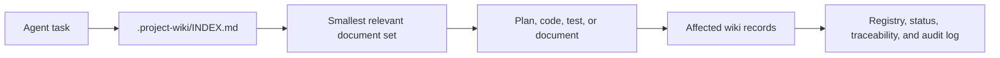

<h1 align="center">Project Wiki</h1>

<p align="center"><strong>An extension of <a href="https://gist.github.com/karpathy/442a6bf555914893e9891c11519de94f">Karpathy's LLM Wiki</a>: durable, traceable project memory for AI coding agents.</strong></p>

<p align="center">
Turn requirements, decisions, code knowledge, and project history into an indexed wiki that lives beside the source code and stays useful across agent sessions.
</p>

<p align="center">
  <a href="#quick-start">Quick start</a> &middot;
  <a href="#see-it-in-action">Examples</a> &middot;
  <a href="#command-modes">Commands</a> &middot;
  <a href="#documentation">Documentation</a> &middot;
  <a href="#contributing">Contributing</a>
</p>

<p align="center">
  
  
  
  
  
</p>

<p align="center">
  <a href="LICENSE"></a>
  
  
  
  
</p>

Project Wiki is an IDE-neutral agent skill for creating and maintaining an agent-readable knowledge base in `.project-wiki/`. It works with chat-based coding agents such as GitHub Copilot in VS Code, Claude Code, Antigravity, Codex, Cursor, and other compatible tools that can read and write repository files.

Runtime paths, artifact names, and generated values are defined once in [schema/project-wiki.yml](schema/project-wiki.yml).

The wiki is designed for **progressive disclosure**: agents start at one short index, follow the smallest relevant set of links, and avoid flooding the context window with the entire project history.

> [!TIP]
> **Zero-Friction Workflow**: Once initialized, you don't need manual commands for everyday tasks. Agents automatically consult `.project-wiki/` before coding and update affected documentation and traceability before completing the response.

## Why Project Wiki?

AI coding sessions are temporary. Requirements, architectural decisions, implementation details, and the reasons behind a change are not.

When that knowledge is scattered across chats, meeting notes, source documents, and source code, every new session starts with reconstruction. Project Wiki keeps the durable parts inside the repository and gives agents a repeatable way to retrieve and maintain them.

| Without Project Wiki | With Project Wiki |
| :--- | :--- |
| **Context loss**: Re-explain architecture, intent, and rules in every new chat | **Persistent memory**: Agents instantly recall project context, goals, and constraints |
| **Silent drift**: Requirements and code evolve independently and fall out of sync | **Bidirectional traceability**: Code, requirements, ADRs, and tests stay explicitly linked |
| **Ephemeral knowledge**: Key decisions and meeting notes get lost in chat history | **Structured capture**: Notes and chats are classified into specs, CRs, and ADRs |
| **Context bloat & guessing**: Agents load too many files or hallucinate missing facts | **Progressive disclosure**: Agents use `INDEX.md` to load only the exact records needed |
| **Stale documentation**: Manual code refactors leave documentation outdated | **Effortless sync**: Reconcile docs with real code changes via `/project-wiki sync` |
| **Implicit risks & gaps**: Contradictions, assumptions, and edge-cases remain hidden | **Active governance**: Continuous semantic linting tracks gaps, risks, and alerts explicitly |

## Quick Start

### 1. Install the skill

You can install Project Wiki either **globally** on your machine (for your personal use across all projects) or **inside the repository** (to share it with your entire team via Git).

| Scope | Description | Typical Path |
| :--- | :--- | :--- |
| **Personal (Global)** | Active for all your local projects | `~/.agents/skills/project-wiki/`<br>`~/.claude/skills/project-wiki/` |
| **Repository (Shared)** | Committed to Git; available to everyone on the team | `.agents/skills/project-wiki/`<br>`.github/skills/project-wiki/` |

For example, to install it personally for Agent Skills compatible tools:

```bash
mkdir -p ~/.agents/skills
cp -R /path/to/project-wiki ~/.agents/skills/project-wiki
```

### 2. Create the first wiki

From the target repository, initialize a new project:

```text
/project-wiki init
```

Or scan a repository that already contains meaningful source code:

```text
/project-wiki scan
```

The slash-style form is an invocation hint, not a strict CLI. Natural language works too:

```text
Use the project-wiki skill in scan mode. Analyze this repository and create the initial project wiki.
```

### 3. Work normally

Once `.project-wiki/INDEX.md` exists, ask the agent for ordinary implementation, debugging, refactoring, testing, documentation, or planning work. The skill should consult the relevant wiki context before acting and update affected wiki records after agent-made source changes.

## See It In Action

### Turn meeting notes into project history

```text
/project-wiki update

- Release one includes email notifications, not SMS.
- Tickets need low, medium, high, and urgent priorities.
- Administrators need CSV export.
- PostgreSQL is preferred over SQLite.
- It is unclear who can delete a closed ticket.
```

The update classifies explicit intent, creates lightweight change or decision records where appropriate, reconciles existing open questions, and refreshes status, registry, traceability, and the wiki audit log.

### Implement with automatic context

```text
Implement CSV export for ticket lists.
```

When the wiki exists, the agent should read the relevant requirement and technical records, implement and validate the change, then update affected docs and traceability before finishing. No separate `consult` command is required, and `sync` is not needed for source changes made by the agent in the same workflow.

### Reconcile manual changes

```text
/project-wiki sync

I manually changed the billing module and its tests outside this chat.
Reconcile the wiki with the current repository state.
```

The agent inspects changed source paths, updates observed technical behavior, and records an open question instead of inventing product intent when the intended scope is unclear.

### Repair wiki health

```text
/project-wiki maintain

Audit the wiki for broken links, missing registry entries, duplicate IDs,
stale indexes, unlinked records, and outdated status notes.
```

Maintenance runs deterministic structural validation first, repairs safe findings, then uses agent-assisted semantic lint for contradictions, stale meaning, traceability quality, and risks.

## How It Works



Project Wiki is built around three distinct architectural layers:

1. **Routing & Discovery Layer (`INDEX.md`, `REGISTRY.yml`, Section Indexes)**:
   Maintains a high-level map of the project. When an agent receives a prompt, it consults `INDEX.md` and loads only the minimal relevant subset of files, protecting the LLM context window from token bloat.
2. **Canonical Knowledge Layer (`requirements/`, `changes/decisions/`, `technical/`, `traceability/`, `alerts/`)**:
   The structured long-term memory of the repository. Every requirement (`REQ-*`), decision (`ADR-*`), and change request (`CR-*`) has a permanent ID and explicit links to related source code paths.
3. **Active Agent Engine (Preflight, Auto-Update, Ingestion, `sync`, `maintain`)**:
   The operational skill runtime that keeps the wiki synchronized with the codebase. It automatically reads context before coding and updates documentation after changes without requiring manual user commands.

> [!NOTE]
> **The Knowledge Provenance Principle**: Raw external documents (PDF, DOCX) ingested via `intake/` are treated as **provenance** (evidence), never as unreviewed canonical truth. Information becomes canonical only when classified and integrated into official wiki records. Likewise, code scanned via `sync` documents observed technical reality, while confirmed business requirements require explicit product intent.

### Skill Layout

- `SKILL.md` is the runtime entrypoint and links directly to the focused workflow for each mode or automatic trigger.
- `schema/project-wiki.yml` is the machine-readable contract.
- `references/` owns focused workflow, structure, and ingestion guidance.
- `assets/document-templates.md` routes to focused, copyable template catalogs.
- `scripts/` provides exclusive new-wiki scaffolding, inbox deduplication, document extraction, structural validation, and contract drift checks.

## Command Modes

The skill exposes these user-facing modes:

```text
init | scan | update | sync | maintain
```

These are hints, not a strict CLI parser. In Copilot, you can invoke the skill with prompts such as `/project-wiki init`. In other agents, use natural language such as "Use the project-wiki skill in scan mode".

| Mode | Purpose |
| --- | --- |
| `init` | Create a complete `.project-wiki/` scaffold for a new project. |
| `scan` | Analyze an existing codebase and generate the initial wiki. |
| `update` | Convert meeting minutes, documents, chat notes, planning notes, or new requirements into wiki updates. |
| `sync` | Reconcile the wiki with source code changes made manually or outside the current agent chat flow. |
| `maintain` | Run deterministic structure validation, repair safe findings, then perform semantic lint, alert review, stale-meaning analysis, and traceability review. |

You do not have to use these exact argument hints for the skill to be useful. They are invocation hints for explicit wiki-management tasks. The skill can still be selected by an agent when your request matches its description, such as asking to document requirements, update the project knowledge base, sync manual code changes, or implement code in a repository that already has `.project-wiki/`.

During `init` and `scan`, the skill also installs repository-level always-on instructions so future coding tasks keep using the wiki even when the user does not explicitly invoke the skill.

When `.project-wiki/` is absent, `init` and the first `scan` use `wiki_scaffold.py` to generate the fixed canonical skeleton in staging, validate it, and publish it without replacing an existing target. A successful scaffold is not a completed initialization: project identity, code understanding, traceability, always-on instructions, and the final audit entry remain agent-owned semantic work.

## Automatic Behavior

After initialization, ordinary coding requests do not need a wiki command:

- **Before code work**, the agent starts at `.project-wiki/INDEX.md` and follows only the smallest relevant context path.
- **After agent-made code changes**, it updates affected technical docs, traceability, status, registry entries, and the wiki audit log.
- **For durable answers**, it updates the owning canonical page or files a linked analysis only when the result has lasting project value.
- **During `init` and `scan`**, it installs a marked project-wiki block in both `AGENTS.md` and `.github/copilot-instructions.md` without overwriting unrelated instructions.

See [Automatic Context Preflight](references/automatic-workflows.md#automatic-context-preflight), [Automatic Post-Implementation Wiki Update](references/automatic-workflows.md#automatic-post-implementation-wiki-update), and [Always-On Project Instruction Bootstrap](references/automatic-workflows.md#always-on-project-instruction-bootstrap) for the full procedures.

## Generated Wiki

Every project wiki lives at `.project-wiki/` in the repository root.

The complete structure is always created. Files that are not useful yet can remain empty or marked as placeholders.

```text
.project-wiki/
|-- INDEX.md              # Root routing map (entrypoint for agents & humans)
|-- PROJECT.md            # Project vision, core constraints, and stack
|-- STATUS.md             # Current milestone, active work, and blockers
|-- REGISTRY.yml          # Machine-readable catalog of all wiki documents
|-- WIKI_VERSION.yml      # Applied schema version tracker
|-- requirements/         # Product intent and routing
|   |-- functional/       # Functional topic index and atomic REQ records
|   `-- non-functional/   # Non-functional topic index and atomic NFR records
|-- changes/
|   |-- requests/         # Agile Change Requests (CRs)
|   `-- decisions/        # Architectural Decision Records (ADRs)
|-- technical/            # System architecture and component technical docs
|-- implementation/       # Work breakdowns, scans, and sync reports
|-- traceability/         # Requirement-to-code traceability matrices
|   `-- requirement-evidence.yml  # Machine-facing atomic provenance
|-- sources/
|   `-- inbox/            # Drop zone for external raw documents
|-- intake/               # Extracted artifacts and chunks from ingested docs
|-- analysis/             # Deep-dive trade-offs and multi-record syntheses
|-- maintenance/          # Structural validation and semantic health reports
|-- alerts/               # Active warnings, risks, and unresolved conflicts
`-- logs/                 # Chronological audit log of knowledge base edits
```

The machine-readable tree, frontmatter fields, ID patterns, registry versions, and status domains live in [schema/project-wiki.yml](schema/project-wiki.yml). Their human-readable explanation lives in [references/wiki-structure.md](references/wiki-structure.md), and CI verifies the two remain aligned. The always-on instruction files live outside `.project-wiki/`.

## Core Indexing Model

Navigation has three levels: root `INDEX.md`, section indexes, then focused records. `REGISTRY.yml` provides the machine-readable catalog, while `WIKI_VERSION.yml` records the applied version from the schema manifest.

| Area | Responsibility |
| --- | --- |
| `requirements/` | Explicit product intent, constraints, and open questions |
| `changes/` | Change requests, ADRs, and project changelog |
| `technical/` | Observed and implemented architecture, APIs, data, tests, deployment, and security |
| `implementation/` | Current plans, work items, scans, and sync reports |
| `traceability/` | Links among requirements, decisions, documentation, and source paths |
| `sources/` and `intake/` | Raw documents and immutable extraction provenance |
| `analysis/`, `alerts/`, `maintenance/` | Durable synthesis, active risks, structural validation, and semantic lint |
| `logs/` | Append-only audit history for wiki changes |

Agents move progressively from indexes to records instead of loading the whole knowledge base. Product intent stays in requirements; code-observed behavior stays technical until an explicit source confirms it as intent.

## Document Intake

Document intake is used when `/project-wiki update` receives an external requirements document, finds a new file in `.project-wiki/sources/inbox/`, or receives a retrievable local document path.

For source inbox files, the agent first runs the deterministic preflight. It processes new unique content, skips byte-identical inbox or historical duplicates found in the registry or prior intake records, and requests semantic review only when a historical path contains changed bytes.

```bash
python3 /path/to/project-wiki/scripts/check_inbox.py \
  --wiki-root .project-wiki \
  --format json \
  --quarantine-skips
```

PDF and DOCX sources are never read directly into model context. After preflight authorization, the agent runs [scripts/ingest_document.py](scripts/ingest_document.py), then reviews generated `intake/` artifacts.

```bash
python3 /path/to/project-wiki/scripts/ingest_document.py \
  .project-wiki/sources/inbox/requirements.pdf \
  --wiki-root .project-wiki \
  --expected-sha256 <sha256-from-checker>
```

Source inbox registry checks and wiki validation require PyYAML; wiki link and heading validation also requires markdown-it-py. PDF and DOCX extraction additionally requires PyMuPDF and python-docx. Install the helper dependencies with:

```bash
python3 -m pip install -r /path/to/project-wiki/scripts/requirements.txt
```

The intake workflow, supported formats, chunking behavior, direct-integration policy, blocking review gate, and status semantics live in [references/document-ingestion.md](references/document-ingestion.md). The focused `review.md` body lives in [assets/intake-source-templates.md](assets/intake-source-templates.md#document-intake-review), while source inbox actions live in [references/update-workflows.md](references/update-workflows.md#source-inbox-workflow).

Each intake document contains provenance in `source-info.yml`, compact routing in `intake-report.md`, a machine-facing `chunks.json` manifest, exhaustive review coverage in `review-progress.yml`, full-text files under `chunks/`, and a compact extraction index in `extracted.md`.

Agents use `review_progress.py inspect` for a compact outline and review state, then `view --section` only for reliable source-defined sections or `view --all` whenever structure is unclear or full context matters. After complete coverage, `audit` emits a compact ledger status, summary, and SHA-256 checkpoint; `view --chunks` retrieves only selected source units. Every chunk must still be classified or skipped with a reason; integrated classifications must link to registered wiki IDs.

## Deterministic Governance

| Helper | Purpose |
| --- | --- |
| `wiki_scaffold.py` | Creates and validates the fixed canonical skeleton only when the target wiki is absent; never merges or overwrites |
| `check_inbox.py` | Hashes inbox documents, detects historical/current duplicates, and returns `process`, `skip`, or `review` |
| `review_progress.py` | Inspects intake state, checkpoints ledger coverage, renders selected source views, and applies ledger updates atomically |
| `validate_wiki.py` | Validates tree, YAML/JSON, frontmatter, IDs, registries, paths, links, anchors, and intake artifacts |
| `check_contracts.py` | Prevents drift among the manifest, README, workflows, templates, and CI-bound documentation |

`maintain` runs structural validation before agent-assisted semantic lint. Deterministic tools establish facts; the agent handles meaning-dependent questions such as contradictions, implicit requirements, stale claims, and traceability quality.

## Documentation

The README is an orientation guide. The manifest is canonical for machine-readable schema values; reference files explain the workflows and policies:

| Need | Source |
| --- | --- |
| Machine schema version, tree, frontmatter fields, statuses, and ID patterns | [schema/project-wiki.yml](schema/project-wiki.yml) |
| Human structure, registry, linking, and lifecycle policy | [references/wiki-structure.md](references/wiki-structure.md) |
| Runtime routing by mode or automatic trigger | [SKILL.md](SKILL.md) |
| Automatic context, initialization, update/intake, sync, and maintenance procedures | [references/automatic-workflows.md](references/automatic-workflows.md), [references/initialization-workflows.md](references/initialization-workflows.md), [references/update-workflows.md](references/update-workflows.md), [references/synchronization-workflow.md](references/synchronization-workflow.md), [references/maintenance-workflows.md](references/maintenance-workflows.md) |
| External document intake, chunking, direct integration, blocking review decisions | [references/document-ingestion.md](references/document-ingestion.md) |
| Template routing by artifact family | [assets/document-templates.md](assets/document-templates.md) |
| Copyable core, requirement/change, technical/implementation, intake/source, and governance templates | [assets/core-templates.md](assets/core-templates.md), [assets/requirements-change-templates.md](assets/requirements-change-templates.md), [assets/technical-implementation-templates.md](assets/technical-implementation-templates.md), [assets/intake-source-templates.md](assets/intake-source-templates.md), [assets/governance-templates.md](assets/governance-templates.md) |
| Documentation and template drift checks | [scripts/check_contracts.py](scripts/check_contracts.py) |
| New-wiki scaffold CLI | [scripts/wiki_scaffold.py](scripts/wiki_scaffold.py) |
| Source inbox duplicate preflight and CLI options | [scripts/check_inbox.py](scripts/check_inbox.py) |
| Extraction implementation and CLI options | [scripts/ingest_document.py](scripts/ingest_document.py) |
| Deterministic wiki structure validation and CLI options | [scripts/validate_wiki.py](scripts/validate_wiki.py) |

## Compatibility And Scope

Project Wiki is a portable instruction-based skill rather than a hosted service. It can be installed personally or committed with a repository, and the generated knowledge remains plain Markdown and YAML inside the target project.

The skill can be selected explicitly through the five command modes or implicitly when a compatible agent recognizes a project-wiki task. Exact invocation syntax depends on the host agent; the workflow and generated wiki remain the same.

Plain wiki reading and writing can remain Markdown-only. Deterministic inbox, validation, contract, and document-intake workflows require Python plus `scripts/requirements.txt`; PDF and DOCX extraction additionally use PyMuPDF and python-docx.

During `init` and `scan`, the skill also creates or updates both repository-level always-on instruction files:

```text
AGENTS.md                       # Claude Code, Codex, or general agents
.github/copilot-instructions.md  # GitHub Copilot / VS Code Copilot
```

Existing content in those files must be preserved. Only the `PROJECT-WIKI` marked block should be inserted or replaced.

## Contributing

Bug reports, design discussions, and pull requests are warmly welcome!

- Please read our [Contributing Guide](CONTRIBUTING.md) for local testing instructions, development setup, and the Pull Request checklist.
- Review our [Code of Conduct](CODE_OF_CONDUCT.md) for community standards.
- Review our [Security Policy](SECURITY.md) to report vulnerabilities responsibly.

Before submitting changes, run:

```bash
python3 -m unittest discover -s tests -v
python3 scripts/check_contracts.py
```

## Design Principles

- **Progressive disclosure**: load only the records needed for the current task.
- **Single source per fact**: define machine contracts once and link to them from explanatory docs.
- **Intent vs. observation**: keep explicit product intent separate from code-observed behavior.
- **Provenance before canon**: integrate reviewed source information; do not treat extraction as truth.
- **Stable traceability**: connect durable IDs to decisions, docs, tests, and source paths.
- **Explicit uncertainty and evidence**: track open questions and alerts; resolve rather than delete them.

## License

Project Wiki is available under the [MIT License](LICENSE).
